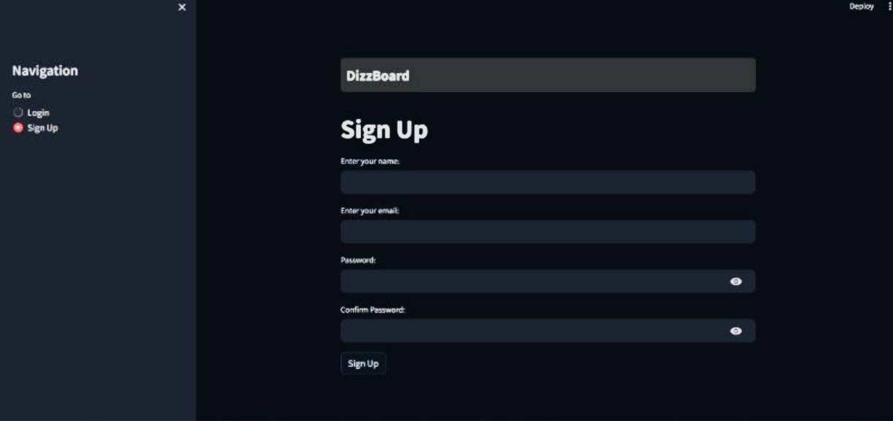
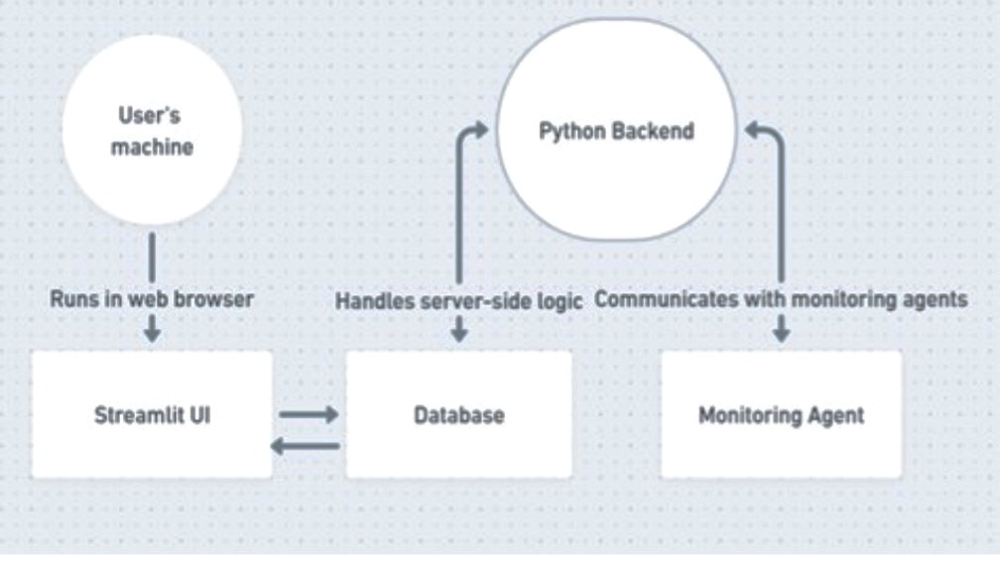
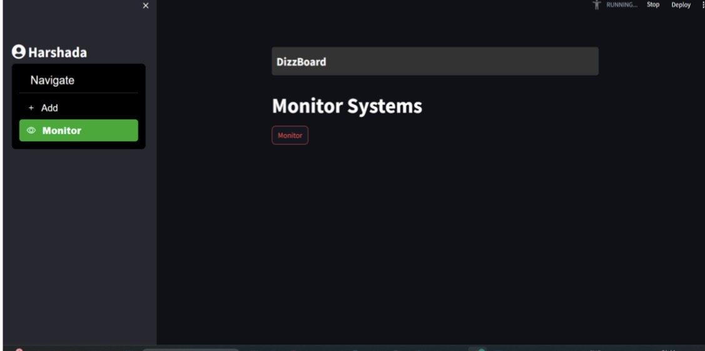
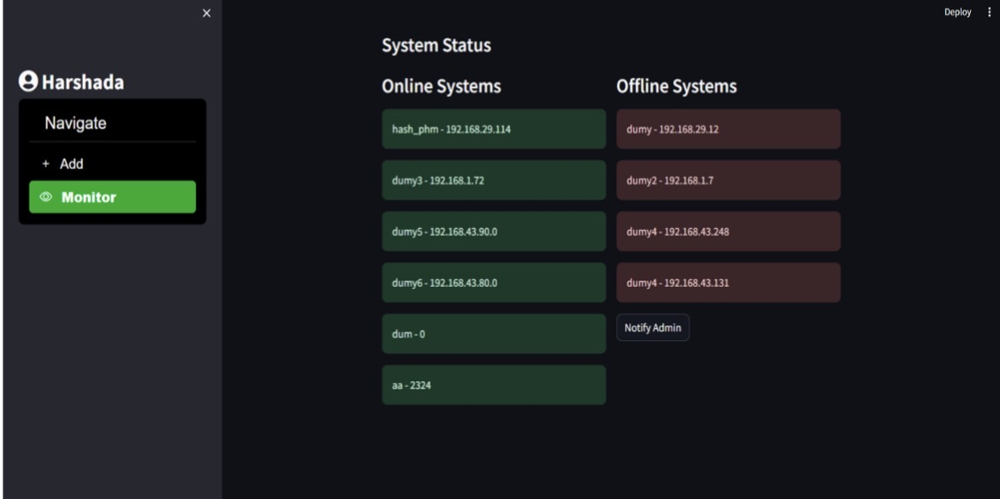
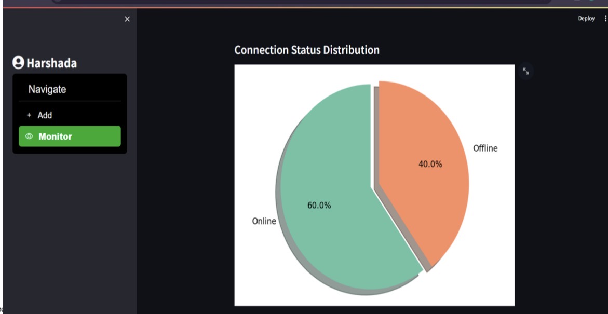
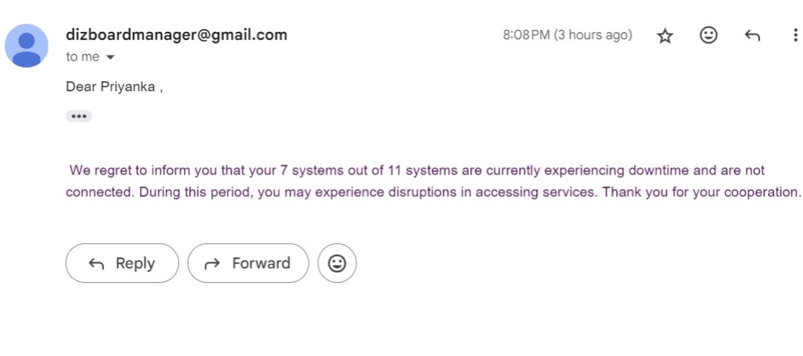
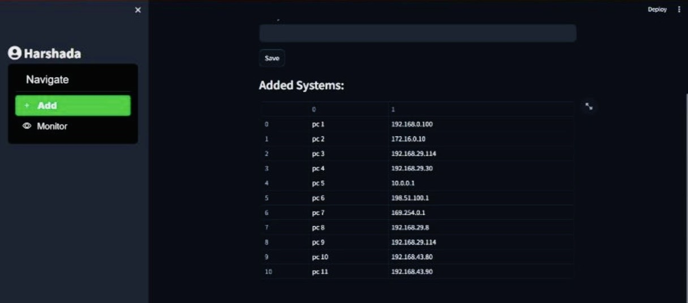

# Real-Time Data Monitoring and Visualization System

## 🚀 Overview
This project focuses on the design and development of a real-time data monitoring and visualization system using Streamlit. It enables efficient tracking, analysis, and visualization of system data in real time.

## 🌍 Real-world Implementation
This system was implemented and deployed in a college laboratory environment to monitor live system status (online/offline). It enables efficient tracking of system availability, detection of failures, and supports proactive management of networked systems.

## 🎯 Key Features
- Real-time system monitoring (online/offline status)
- Interactive dashboard interface
- Data visualization using charts and graphs
- System performance tracking
- Email notifications for system status alerts
- Centralized monitoring of multiple systems

## 🛠️ Technologies Used
- Python
- Streamlit
- MySQL me
- Pandas
- Networking tools (e.g., ping3)
- SMTP (for email alerts)

## 📊 Project Description
The project was developed as part of my final year work. It focuses on building a user-friendly dashboard that simplifies monitoring of multiple systems in a network. The system processes real-time data, displays system status, and provides insights through visual analytics.

## 📄 Research Publication
This project led to a research publication in the domain of application monitoring and data-driven systems, highlighting its practical implementation and effectiveness.

## 📷 Screenshots

### Login Interface

### System Architecture

### Monitoring Dashboard

### System Status (Online/Offline)

### Data Visualization

### Email Alert System

### System Management (Adding & Tracking Systems)

## 🧠 Key Learnings
- Real-time data processing and monitoring
- Data visualization and dashboard development
- Integration of backend systems with UI
- Practical implementation of data analytics concepts
- Building scalable and user-friendly applications

## 📬 Contact
For more details, feel free to connect with me.
